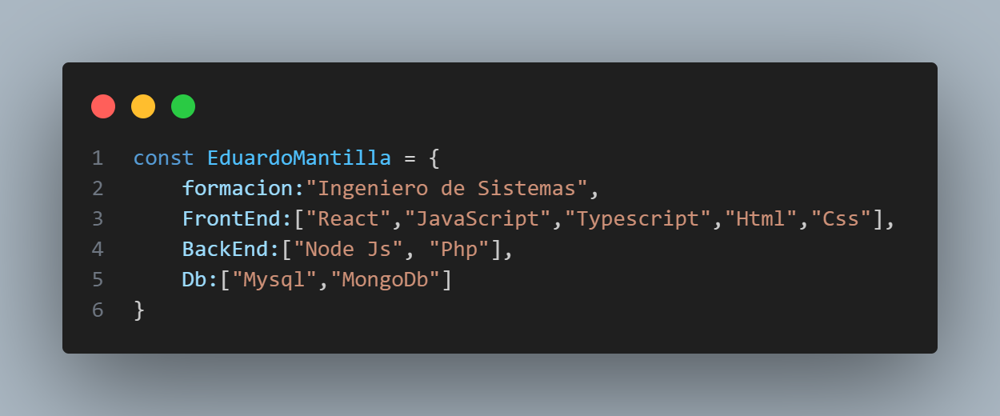

## <i>¡Hola que tal! </i> 👋  
💚 <i style="font-size:16px">Ingeniero de Sistemas - 2022 - Unidades Tecnologicas de Santander </i> 
 💙 <i style="font-size:16px">CampusLands - 2023 </i>
 

 📩 Soy Eduardo Mantilla, desarrollador de software apasionado por la tecnologia y creacion de aplicaciones a nivel empresarial o personal. 
 

 Gracias a mis habilidades en desarrollo, gestión de bases de datos y seguridad de la información, he logrado alcanzar el éxito en cada meta que me propongo. 
 

 🧩 Me gusta conectar con diversas personas, asi que si te apatece saludar, ¡estare encantado de conectar mejor! :)  
 

  
    
  

